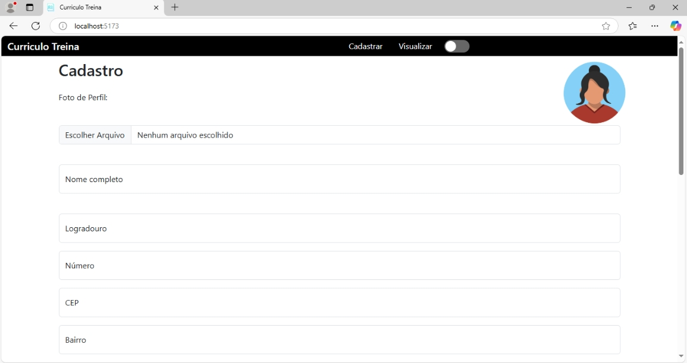

# Currículo Dinâmico ​📑

Este projeto tem como objetivo a criação de um currículo dinâmico. Desenvolvido como projeto final do curso de Desenvolvimento Full Stack da Treina Recife, com orientação do professor João Ferreira.

## Tecnologias Utilizadas 🛠️​💻​

**Frontend**  
- React  
- Vite  
- Bootstrap 5.3  
- JavaScript

**Backend**  
- Java  
- Spring Boot  
- Spring Data JPA  
- MySQL

## Como Rodar o Projeto Localmente ⚙️​


## **Backend (Spring API)**

### Pré-requisitos
Antes de começar, certifique-se de ter os seguintes itens instalados no seu computador:

- [Java 17](https://www.oracle.com/br/java/technologies/downloads/)
- [Maven](https://maven.apache.org/download.cgi)
- [MySQL](https://www.mysql.com/downloads/)
- [VSCode](https://code.visualstudio.com/)

### Para rodar
1. **Clonar o Repositório**
Abra o terminal e execute o comando para clonar o repositório:

```bash
git clone https://github.com/milenemachado/projetoTreina
```
2. **Acessar a Pasta do Backend**
Navegue até a pasta do backend (onde o código da API está localizado):

```bash
cd projetoTreina/springapi
```
3.**Configuração do Banco de Dados**
Abra o arquivo `src/main/resources/application.properties` e atualize com as credenciais do seu banco de dados MySQL (usuário, senha, nome do banco de dados, etc.).

4.**Executar o Backend**
Para rodar o servidor do backend, utilize o Maven com o comando abaixo:

```bash
./mvnw spring-boot:run
```
O backend estará disponível no endereço http://localhost:8080/.


## **Frontend**

### Pré-requisitos
Antes de começar, certifique-se de ter os seguintes itens instalados no seu computador:

- [Node.js e o npm](https://nodejs.org/en/download)
- [VSCode](https://code.visualstudio.com/)
### Para rodar
1.**Acessar a Pasta do Frontend**
Navegue até a pasta `frontend` dentro do diretório do projeto:
```bash
cd projetoTreina/frontend
```
2.**Instalar Dependências**
Execute os comandos abaixo para instalar todas as dependências necessárias:
```bash
npm install
npm install  react-router-dom react-bootstrap bootstrap html2canvas jspdf
```
3.**Iniciar o Servidor**
Para rodar o servidor do frontend, use:
```bash
npm run dev
```
O projeto será executado no navegador em http://localhost:5173/.

## Licença
[Creative Commons Zero v1.0 Universal](https://github.com/milenemachado/projetoTreina/blob/main/LICENSE)

## Autora 
[Milene Machado](https://github.com/milenemachado)
